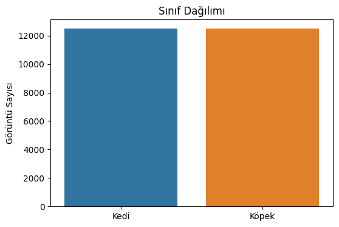
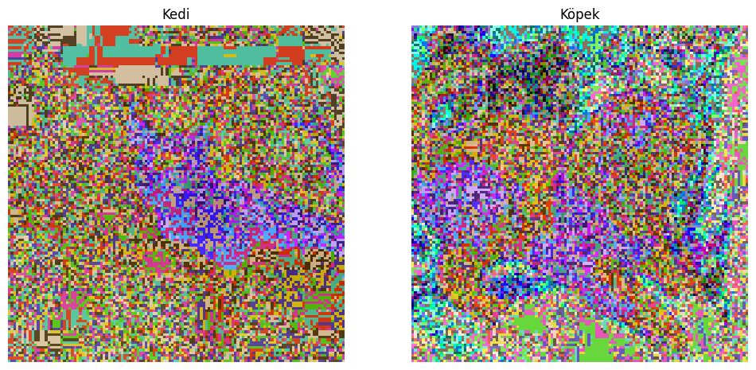
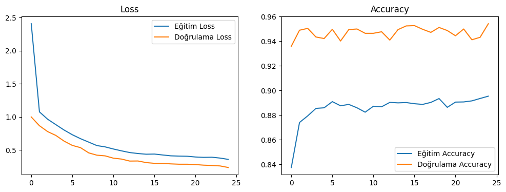
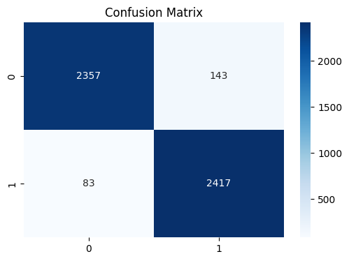
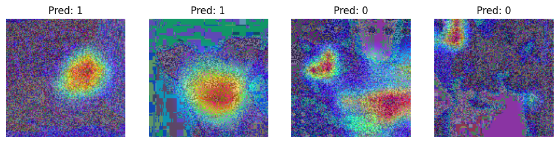

# 🐱 vs 🐶 Kedi ve Köpek Sınıflandırması - CNN ile Transfer Öğrenimi

## 📋 Proje Amacı
Bu projede, **Dogs vs. Cats** veri seti kullanılarak derin öğrenme tabanlı bir görüntü sınıflandırma modeli geliştirilmiştir. Temel amaç, evrişimli sinir ağları (CNN) ve transfer öğrenimi teknikleriyle yüksek doğrulukta kedi-köpek sınıflandırması yapmaktır.

## 📊 Veri Seti Hakkında
- **Veri Seti:** Dogs vs. Cats (Kaggle)
- **Tür:** Binary Classification (2 sınıf)
- **Boyut:** ~25.000 eğitim görüntüsü
- **Sınıflar:** Kedi (12.500), Köpek (12.500)
- **Görüntü Formatı:** RGB, değişken boyutlar

### Veri Dağılımı

## 🛠️ Kullanılan Yöntemler

### 1. Veri Ön İşleme
- Görüntülerin 128x128 piksel boyutuna yeniden ölçeklendirilmesi
- VGG16 için uygun preprocessing işlemleri
- Verinin eğitim/doğrulama/test olarak bölünmesi (%80/%16/%4)

### 2. Veri Artırma (Data Augmentation)
- Döndürme (±40°)
- Yatay/dikey kaydırma (±30%)
- Yatay çevirme
- Yakınlaştırma (±30%)
- Parlaklık ayarlaması (%70-130)

### 3. Model Mimarisi
- **Taban Model:** VGG16 (ImageNet ağırlıkları)
- **Transfer Öğrenimi:** Taban katmanlar dondurulmuştur
- **Özelleştirilmiş Katmanlar:**
  - Flatten katmanı
  - 512 nöronlu Dense katman (L2 regularizasyonlu)
  - Dropout katmanı
  - 2 nöronlu çıkış katmanı (softmax)

### 4. Hiperparametre Optimizasyonu
- Random Search ile 3 farklı kombinasyon test edildi
- Optimize edilen parametreler: learning_rate, dropout_rate, batch_size

### 5. Eğitim Stratejileri
- Early Stopping (patience=7)
- Model Checkpointing
- ReduceLROnPlateau (patience=3)
- L2 Regularization (λ=0.001)

## 📈 Elde Edilen Sonuçlar

### Model Performans Metrikleri
- **Test Doğruluğu (Accuracy):** %95.48
- **Validation Doğruluğu:** %95.42

### Detaylı Sınıflandırma Raporu

          precision    recall  f1-score   support

    Kedi       0.97      0.94      0.95      2500
   Köpek       0.94      0.97      0.96      2500

accuracy                           0.95      5000

macro avg 0.96 0.95 0.95 5000
weighted avg 0.96 0.95 0.95 5000

- **Precision (Kedi):** %97
- **Recall (Köpek):** %97  
- **F1-Score (Macro Avg):** 0.95

### Eğitim Süreci Grafikleri

### Karışıklık Matrisi

### Grad-CAM Görselleştirmesi
Modelin karar verme sürecini anlamak için Grad-CAM tekniği uygulanmıştır:

## 🎯 Sonuç Özeti
- Model dengeli bir şekilde eğitilmiştir (overfitting/underfitting yok)
- %95.48 test doğruluğu ile yüksek performans elde edilmiştir
- Sınıflar arasında dengeli sonuçlar (Kedi: 0.97 precision, Köpek: 0.97 recall)
- Grad-CAM görselleştirmesi ile modelin karar mekanizması interpret edilebilmiştir
- Transfer öğrenimi sayesinde sınırlı veriyle etkili sonuçlar alınmıştır

## 🔗 Kaggle Notebook
Projenin tamamını ve çalışan kodları aşağıdaki Kaggle notebook'tan inceleyebilirsiniz:

[📓 Kaggle Notebook - Derin Öğrenme CNN Projesi](https://www.kaggle.com/code/recepbaak/derin-renme-cnn-projesi/notebook)

**Not:** Lütfen versiyon 1'e bakınız. Versiyon 2 sadece "Run All" işlemi için kaydedilmiştir.

